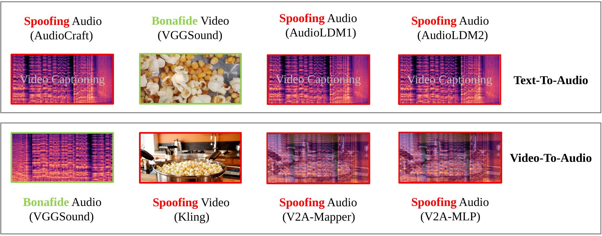
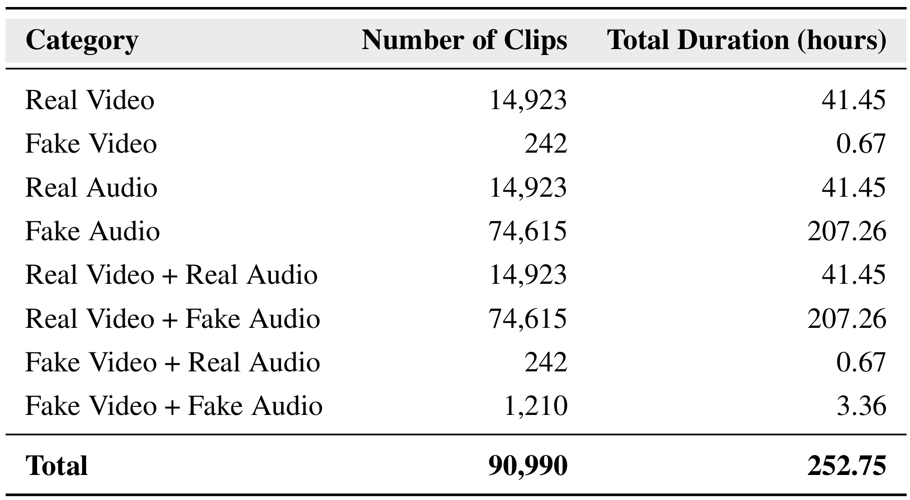
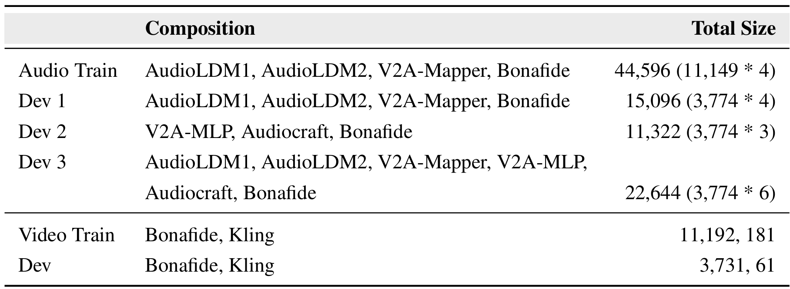

# VCapAV: AVideo-Caption Based Audio-Visual Deepfake Detection Dataset

<p align="center">
  <a href="https://sites.duke.edu/dkusmiip/files/2025/05/VCapAV-A-Video-Caption-Based-Audio-Visual-Deepfake-Detection-Dataset.pdf">
    
  </a>
  <span style="display:inline-block; width:24px;"></span>
  <a href="https://doi.org/10.5281/zenodo.15498946">
    
  </a>
  <span style="display:inline-block; width:24px;"></span>
  <a href="https://vcapav.github.io/">
    
  </a>
</p>

<!-- Head Image -->
<p align="center">
  
</p>

This repository provides the **VCapAV dataset**, which contains both forged and real audio-visual samples, with a focus on environmental sound manipulations. It includes baseline detection models such as **AASIST**, **ResNet18**, and **LCNN**, enabling focused evaluation of non-speech audio forgeries generated through Text-to-Audio and Video-to-Audio synthesis.

## Dataset Overview

The VCapAV dataset comprises 14,923 original audio-visual clips, each no longer than 10 seconds with audio downsampled to 16kHz. It includes 14,923 real videos and 242 fake videos (generated via Kling), paired with 14,923 real audios and 74,615 fake audios synthesized using five methods: TTA (Text-to-Audio via AudioLDM1, AudioLDM2, and AudioCraft) and V2A (Video-to-Audio via V2A-Mapper and V2A-MLP). The dataset provides combinations of real and fake video/audio pairs, supporting fine-grained evaluation of cross-modal deepfake detection.



> **Note:** For most audio-visual detection applications, we recommend starting with the `ResNet18 + LCNN` ensemble.

---

## Repository Structure

```
VCapAV/
├── _engineering/          # Internal tools and engineering utilities
├── aasist/                # AASIST model and dataset-specific code
│   ├── config/            # AASIST config files (.conf)
│   ├── dev/               # Dev set data
│   ├── train/             # Training set data
│   ├── protocols/         # Protocol definition files
│   ├── models/            # Pretrained weights or model checkpoints
│   ├── utils.py           # AASIST-specific utility functions
│   └── download_dataset.py# Script to download dataset
├── clipclap/              # CLAP-based audio-visual feature extractor
├── configs/               # Training configs (ResNet18, LCNN, etc.)
├── dataset/               # Data loading and preprocessing logic
├── exp/                   # Training output directory
├── log/                   # Logging and evaluation output
├── modules/               # Model architectures and backbones
├── utils/                 # Shared utility functions
├── features.py            # CLAP feature extraction interface
├── infer_from_score.py    # Score post-processing and metric calculation
├── main.py                # Entry point for training and evaluation
├── model_utils.py         # Model loading / saving / optimizer utils
├── other_utils.py         # Miscellaneous utility functions
├── requirement.txt        # Top-level Python package requirements
├── LICENSE
└── README.md
```

---

## Environment Setup

```bash
conda create -n vcapav python=3.8
conda activate vcapav
pip install -r requirement.txt
```

---

## Data Preparation

### Protocol Composition


### File Format Details

Dataset directory should be organized as follows:

```
dataset/
├── train/
│   ├── wav.scp
│   └── utt2label
├── dev/
│   ├── wav.scp
│   └── utt2label
```

**`wav.scp`**  
Each line should contain an utterance ID and the absolute path to the corresponding audio file:

```
UtteranceID1 /path/to/audio1.wav
UtteranceID2 /path/to/audio2.wav
```

**`utt2label`**  
Each line should contain an utterance ID and its label (`bonafide` or `spoof`). This file is required for both training and development sets:

```
UtteranceID1 bonafide
UtteranceID2 spoof
```
### Label Mapping

The script automatically maps the string labels to integers:

- `bonafide` or `genuine` → `1`
- `spoof` or `fake` → `0`

Make sure all utterance IDs in `utt2label` exist in `wav.scp`.

---

## Model Training

### ResNet18

```bash
for seed in 1; do
  python3 -u main.py --comment "train_clean_offset_Resnet" --track "FAD" \
      --gpu 1 --workers 6 --batch_size 64 \
      --exp_dir "exp/clean" --log_dir "log/clean" \
      --trn_data_name "train" --dur_range 7 7 \
      --dev_data_name "dev" \
      --feat "logFbankCal" --preemph False --vad False --data_aug False --snr_range 0 20 \
      --aug_rate 0.7 --is_specaug False --speed_aug False --reverb False \
      --model ResNet18_ASP --model_cfg "configs/main_80.yaml" \
      --mse_loss False \
      --model_pretrain None --loss ce --model_freeze_epoch 0 \
      --classifier Linear --angular_m 0.2 --angular_s 32 --max_step 200000 --dropout 0.4 \
      --use_amp False --start_epoch 0 --num_epochs 150 --warm_up_epoch 1 --lr 0.001 \
      --seed ${seed} \
      --early_stop 50 --offset True
done
```

### LCNN

```bash
for seed in 1; do
  python3 -u main.py --comment "CleanTrain_oneinten_LCNN" --track "ASVspoof5" \
      --gpu 1 --workers 6 --batch_size 64 \
      --exp_dir "exp/clean" --log_dir "log/clean" \
      --trn_data_name "train" --dur_range 7 7 \
      --dev_data_name "dev" \
      --feat "logFbankCal" --preemph False --vad False --data_aug False --snr_range 0 20 \
      --aug_rate 0.7 --is_specaug False --speed_aug False --reverb False \
      --model LightCNN_lstm --model_cfg "configs/main_80.yaml" \
      --mse_loss False \
      --model_pretrain None --loss ce --model_freeze_epoch 0 \
      --classifier Linear --angular_m 0.2 --angular_s 32 --max_step 200000 --dropout 0.4 \
      --use_amp False --start_epoch 0 --num_epochs 150 --warm_up_epoch 1 --lr 0.001 \
      --seed ${seed} \
      --early_stop 50
done
```
### AASIST

```bash
cd aasist
python3 main.py --config ./config/AASIST.conf --comment "aasist"
```

---

## Pretrained Models

| Model                | Size   | Location                                                                 |
|----------------------|--------|--------------------------------------------------------------------------|
| `AASIST.pth`         | 47 MB  | `aasist/models/weights/AASIST.pth`                                      |
| `AASIST-L.pth`       | 86 MB  | `aasist/models/weights/AASIST-L.pth`                                    |
| `clap_htsat_tiny.pt` | 1.7 GB | [`clipclap/clap_htsat_tiny.pt`](https://huggingface.co/mali6/autocap/blob/main/clap_htsat_tiny.pt) |

---

## Citation

```bibtex
@inproceedings{wang2025vcapav,
  title={VCapAV: A Video-Caption Based Audio-Visual Deepfake Detection Dataset},
  author={Wang, Yuxi and Wang, Yikang and Zhang, Qishan and Nishizaki, Hiromitsu and Li, Ming},
  booktitle={Interspeech},
  year={2025}
}
```
---

<div align="center">
  <a href="LICENSE">
    
  </a> &ensp;
  <a href="mailto:wa0009xi@e.ntu.edu.sg">
    
  </a>
</div>


